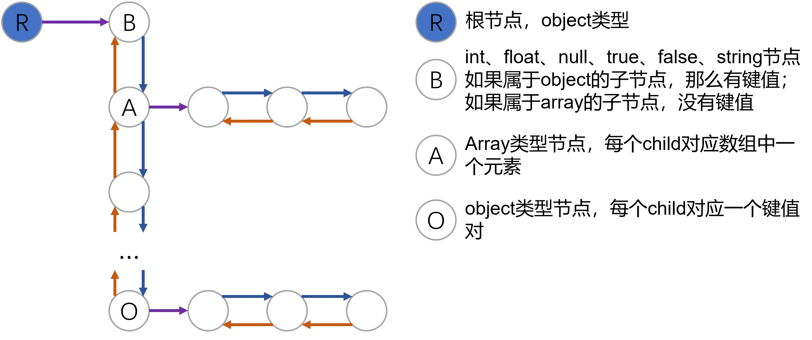

# LJson 
> LJson是一个C++实现的json文件解析、生成、格式化库；

## 作者
Lisheng Xie
* 个人网站: [https://www.lishengxie.top/](https://www.lishengxie.top/)
* github: [https://github.com/lishengxie](https://github.com/lishengxie)

## 使用的数据结构
json官方网站: [https://www.json.org/json-en.html](https://www.json.org/json-en.html)
* json节点类型定义为
```C++
enum JsonType {
    T_FALSE=0, T_TRUE, T_NULL, T_INT, T_FLOAT, T_STRING, T_ARRAY, T_OBJECT
};
```
* 使用抽象的树结构来表示整个json对象，对应链表的数据结构，json节点的数据格式如下：
```C++
class JsonObject {
private:
    struct InitType;
    /* next和prev分别指向前一个对象和后一个对象 */
    JsonObject *next, *prev;
    /* Object和Array类型对象需要设置child指针 */
    JsonObject *child;
    /* Object的类型 */
    JsonType type;
    /* String对象的值 */
    char *valueString;
    /* 整数对象的值 */
    int valueInt;
    /* 浮点数的值 */
    double valueDouble;
    /* 键值对的键 */
    char *key;
}
```
json节点之间用链表表示的关系如下图所示：


## 使用方法

**生成json对象**

```c++
using namespace LJson;
// method 1
auto oJson = Json();
oJson = {
    {"float",12.3},
    {"int",23},
    {"bool",true},
    {"str","string"},
    {"null",nullptr},
    {"stdstr","chenxuan"},
    {"arrFloat",{2.3,8.9,2.3}},
    {"arrBool",{true,false}},
    {"arrObj",{{"chenxuan",{1,0,true, nullptr,"test"}},{"lover","xiaozhu"}}},
    {"empty obj",{}}
};
// method 2
auto oJson2 = Json(R"({"base":{"pp":0,"qq":[1.9, 1, null, false]},"id":32,"name":"fda"} )");
cout << oJson2 << endl;
```

**获取数据**

```C++
double floatVal = oJson["float"].getFloat();
int intVal = oJson["int"].getInt();
bool boolVal = oJson["bool"].getBool();
const char* strVal = oJson["str"].getString();
double floatValInArray = oJson["arrFloat"][0].getFloat();
int arrSize = oJson["arrFloat"].size();
vector<string> oJsonKeys = oJson.getKeys();
```

**格式化输出**

```C++
cout << oJson << endl;
cout << oJson.toString() << endl;
```

**添加或修改键值对(没有会默认添加)** 

```C++
// 添加
oJson2["stdStr"]="koko";
oJson2["strOld"]="ok";
oJson2["null"]=nullptr;
oJson2["bool"]=true;
oJson2["int"]=1000;
oJson2["double"]=1.43;
oJson2["base"]["qq"].add(10);
oJson2["base"]["qq"].add(10.5);
oJson2["base"]["qq"].add(true);
oJson2["base"]["qq"].add("test string");
oJson2["base"]["qq"].add(nullptr);
oJson2["base"].addEmptySubObjectToObject("emptyObj");
oJson2["base"]["qq"].addEmptySubObjectToArray();
oJson2["base"].addEmptySubArrayToObject("emptyArray");
oJson2["base"]["qq"].addEmptySubArrayToArray();
oJson2["base"]["emptyArray"].addEmptySubObjectToArray();
cout << oJson2 << endl;
cout << endl;

// 修改
oJson2["int"] = 10.5;
oJson2["double"] = 1.5;
oJson2["bool"] = false;
oJson2["name"] = "xls";
oJson2["oJson1"] = {
    {"float",12.3},
    {"int",23},
    {"bool",true},
    {"str","string"},
    {"null",nullptr},
    {"arrFloat",{2.3,8.9,2.3}},
    {"arrBool",{true,false}},
    {"arrObj",{{"xls",{1,0,true, nullptr,"test", {{"testKey", "testVal"}}}},{"lover","xls"}}},
    {"empty-obj",{}}
};
cout << oJson2 << endl;
```

**删除**

```C++
// 删除键值对
oJson2.remove("oJson1");
// 删除数组中对应索引处的值
oJson2["base"]["emptyArray"].remove(0);
cout << oJson2 << endl;
```

## 说明
* 技术水平有限难免出现bug，欢迎随时提issues，有空一定认真修改；
* 接口目前有些混乱，另外异常情况目前没有很好地处理；
* 有一些冗余代码，后续考虑使用模版函数进行替换；
* 后续有时间补充整个实现的详细说明；
* 有空继续更新...

## 参考的json库

* https://github.com/ACking-you/MyUtil/tree/master/json-parser
* https://github.com/510850111/cJSON/tree/master
* https://github.com/nlohmann/json